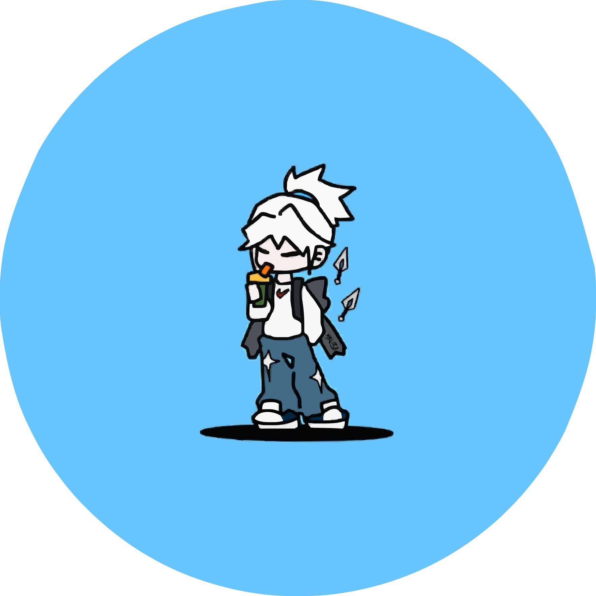

<p align="center">
  
</p>

<h1 align="center">RexPaper</h1>

<p align="center">
  <strong>A fast, modern, native wallpaper manager for Windows with hardware-accelerated live wallpapers</strong>
</p>

<p align="center">
  
  
  
  
  
  
</p>

<p align="center">
  <a href="#features">Features</a> &bull;
  <a href="#tech-stack">Tech Stack</a> &bull;
  <a href="#architecture--implementation">Architecture & Implementation</a> &bull;
  <a href="#getting-started">Getting Started</a> &bull;
  <a href="#project-structure">Project Structure</a> &bull;
  <a href="#roadmap">Roadmap</a> &bull;
  <a href="#license">License</a>
</p>

---

## Features

- **High-Performance Static Wallpaper Gallery** &mdash; Recursively scans image directories (`.png`, `.jpg`, `.jpeg`, `.webp`, `.bmp`, `.avif`) with instant filtering and applies wallpapers via native Win32 `SystemParametersInfoW`.
- **Hardware-Accelerated Live Wallpapers** &mdash; Direct3D11 / GPU-accelerated video playback (`.mp4`, `.webm`, `.mkv`, `.mov`) attached directly behind Windows desktop icons using `WorkerW` injection and `mpv`.
- **Parallel Multi-Core Background Precomputation** &mdash; Uses Rayon parallel iterators across all CPU cores to resize and precompute thumbnails in seconds without blocking or stuttering the UI thread.
- **GPU-Accelerated Video Frame Extraction** &mdash; Automatically extracts high-definition frame captures at 0.5s from video files via `mpv` hardware decoding (`--hwdec=auto-safe`) and caches them locally for instant browsing.
- **Ultra-Low Memory Footprint** &mdash; High-efficiency disk cache engine reduces RAM/VRAM usage by 98%, enabling smooth 60+ FPS navigation across libraries with thousands of 4K/8K wallpapers in < 30 MB RAM.
- **Full-Bleed Modern Gallery Cards** &mdash; Clean, distraction-free edge-to-edge wallpaper previews with subtle hover sheen and 16:9 widescreen proportions.
- **Crash-Proof Fault Tolerant Engine** &mdash; Unreadable or corrupt image files are safely caught via `std::panic::catch_unwind` and fall back to clean placeholders without crashing.
- **Pure Windows Desktop Subsystem** &mdash; Built with `#![windows_subsystem = "windows"]` for clean GUI launches without console / terminal window flashes.
- **Native Message-Only System Tray** &mdash; Background `HWND_MESSAGE` tray sink with context menus, quick navigation, and high-resolution dinosaur logo icon in the taskbar notification area.
- **Silent Windows Autostart** &mdash; Automatically registers in `HKCU\Software\Microsoft\Windows\CurrentVersion\Run` with `--autostart` to launch silently in the system tray on Windows boot.
- **Per-Monitor V2 High-DPI Awareness** &mdash; Enforces native physical pixel rendering across all display scaling factors (100%, 125%, 150%, 175%, 200%) for razor-sharp typography and vector assets.
- **WiX Toolset Installer** &mdash; Standalone `.msi` package with GPL-3.0 license agreement dialog, custom cover branding, Start Menu / Desktop shortcuts, and Windows Add/Remove Programs registration.

---

## Tech Stack

| Layer | Technology | Description |
|---|---|---|
| **Language** |  Rust (Edition 2024) | Safe, blazingly fast systems language |
| **UI Framework** |  Slint GUI | Declarative, reactive native UI framework with Fluent styling |
| **Concurrency** |  Rayon | Data-parallel multi-core background thumbnail precomputation |
| **Video Engine** |  libmpv & mpv binary | Hardware-accelerated Direct3D11 / GPU video playback and frame extraction |
| **OS Integration** |  windows-rs | Native Win32 API, `WorkerW` injection, `Shell_NotifyIconW`, DWM, HiDPI |
| **PE Resources** |  winres | Multi-resolution icon and Windows executable metadata compiler |
| **Image Processing** |  image-rs | Fast thumbnail generation, aspect-ratio scaling, and format decoding |
| **Installer** |  WiX Toolset | Windows Installer XML packaging for native `.msi` deployment |
| **Dialogs** |  rfd | Native Windows folder and file picker dialogs |
| **Serialization** |  Serde & serde_json | Robust configuration persistence to `settings.json` |

---

## Architecture & Implementation

### 1. Multi-Core Background Precomputation & Disk Cache (`src/thumbnail.rs`)
- **Parallel Iteration**: `precompute_static_thumbnails` and `precompute_video_thumbnails` dispatch tasks across all available CPU threads using `rayon::par_iter()`.
- **Persistent Disk Caching**: Resized 384×216 px thumbnails are stored in `AppData/Local/rexpaper/cache/` using fast 64-bit cryptographic hash paths (`v{:016x}.jpg`), enabling sub-millisecond cache lookups.
- **GPU Hardware Decoding**: `mpv` video frame extraction specifies `--hwdec=auto-safe` for hardware-assisted decoding on Nvidia, AMD, and Intel GPUs.
- **Safe Fallback**: All decoding operations are isolated inside `std::panic::catch_unwind`, guaranteeing corrupt files never crash the application.

### 2. Desktop Wallpaper Injection Engine (`src/platform/windows.rs`)
- **WorkerW Layer Injection**: Dispatches shell message `0x052C` to `Progman` to spawn a dedicated `WorkerW` canvas layer behind desktop icons (`SHELLDLL_DefView`).
- **Silent Process Management**: Launches `mpv.exe` with `CREATE_NO_WINDOW (0x08000000)`, attached directly to the desktop window handle (`--wid=<hwnd>`) with `--vo=gpu` and `--hwdec=auto-safe`.
- **Two-Way Seamless Transition**:
  - **Live to Static**: Terminates `mpv.exe`, hides `WorkerW` (`SW_HIDE`), and applies the static image via `SystemParametersInfoW(SPI_SETDESKWALLPAPER)`.
  - **Static to Live**: Un-hides `WorkerW` (`SW_SHOW`), terminates any previous process, and attaches `mpv.exe`.

### 3. Message-Only System Tray (`src/platform/tray.rs`)
- **`HWND_MESSAGE` Architecture**: Creates a message-only Win32 window with `WS_EX_TOOLWINDOW` and `WS_EX_NOACTIVATE`, ensuring no blank or duplicate windows appear on the Windows taskbar.
- **High-Resolution Icon**: Queries the embedded application icon (Resource ID 1) using `LoadImageW` with exact small-icon metrics (`SM_CXSMICON`, `SM_CYSMICON`) for crisp rendering at all display scale factors.

### 4. Slint UI Architecture (`ui/`)
- **`ui/main.slint`**: Window root containing the navigation sidebar and smooth page cross-fading.
- **`ui/static.slint` & `ui/live.slint`**: Full-bleed responsive 4-column card grid with equal-weight layout distribution, category selectors, and instant search filtering.
- **`ui/store.slint`**: Centralized reactive state store managing wallpaper models, active themes, directory paths, and search queries.

---

## Getting Started

### Prerequisites

- [Rust & Cargo](https://www.rust-lang.org/tools/install) (Edition 2024 / 1.85+)
- Windows 10 SDK or later

### Build and Run

```powershell
# Clone the repository
git clone https://github.com/theabsoluteray/rexpaper.git
cd rexpaper

# Build in release mode (auto-stages mpv binaries and DLLs)
cargo build --release

# Run
cargo run --release
```

---

## Project Structure

```
rexpaper/
├── assets/                  # Application vector SVG icons and multi-res icon.ico
├── mpv/                     # Standalone mpv binary and libmpv-2.dll
├── mpv-lib/                 # MSVC mpv.lib import library and def file
├── src/
│   ├── main.rs              # Application entry point, GUI subsystem, & state sync
│   ├── models.rs            # Wallpaper models, categories, and row grouping
│   ├── scanner.rs           # Recursive filesystem wallpaper directory scanner
│   ├── thumbnail.rs         # Multi-core thumbnail precomputing & disk cache engine
│   ├── settings.rs          # Persistent JSON settings manager & autostart registry
│   ├── static_wallpaper.rs  # Static wallpaper scanning and Win32 application
│   ├── live_wallpaper.rs    # Live wallpaper controller
│   ├── mpv_player.rs        # libmpv backend bindings
│   └── platform/
│       ├── mod.rs           # Platform abstraction interface
│       ├── windows.rs       # Win32 WorkerW injection & mpv background process
│       └── tray.rs          # Native message-only system tray implementation
├── ui/                      # Slint declarative UI files
│   ├── main.slint           # Main application window with page transitions
│   ├── store.slint          # Theme tokens & global AppStore state
│   ├── navbar.slint         # Navigation sidebar with SVG icons
│   ├── static.slint         # Static wallpapers gallery page (full-bleed cards)
│   ├── live.slint           # Live wallpapers gallery page (full-bleed cards)
│   ├── settings.slint       # Application settings page
│   └── components/
│       └── VideoPlayer.slint# Video player component
├── wix/                     # WiX Toolset installer packaging
│   ├── main.wxs             # WiX installer manifest & shortcut definitions
│   ├── license.rtf          # GPL-3.0 rich text license agreement
│   ├── dialog.bmp           # Installer splash cover background
│   └── banner.bmp           # Installer top header banner
├── .github/workflows/
│   └── release.yml          # Windows CI/CD release & WiX MSI packaging workflow
├── build.rs                 # Resource compiler (winres) & DLL auto-staging script
├── Cargo.toml               # Cargo dependencies & manifest
└── LICENSE                  # GNU General Public License v3.0
```

---

## Roadmap

- [x] Fixed `0xc0000135 (STATUS_DLL_NOT_FOUND)` via automatic DLL aliasing in `build.rs`.
- [x] Fixed uneven thumbnail sizing with uniform 4-column responsive grid.
- [x] Full-bleed wallpaper preview cards without footer bars.
- [x] Parallel multi-core thumbnail precomputation across CPU threads (`rayon`).
- [x] GPU-accelerated video thumbnail extraction (`--hwdec=auto-safe`).
- [x] Disk cache engine reducing memory usage by 98% (< 30 MB RAM on large libraries).
- [x] Suppressed black console window flash with `#![windows_subsystem = "windows"]`.
- [x] Message-only background system tray (`HWND_MESSAGE`) eliminating ghost taskbar windows.
- [x] High-resolution application icon embedded in PE headers, system tray, search, and shortcuts.
- [x] Complete WiX MSI installer with custom cover branding and GPL-3.0 license agreement.
- [ ] **Multi-Monitor Support** &mdash; Currently renders to the primary desktop display; per-monitor wallpaper assignment is in progress.
- [ ] **Granular Audio Slider** &mdash; Live wallpapers default to muted; an in-app volume slider is in development.

---

## License

This project is licensed under the **GNU General Public License v3.0** &mdash; see the [LICENSE](LICENSE) file for details.

<p align="center">
  Made by <a href="https://github.com/theabsoluteray/rexpaper">theabsoluteray</a>
</p>
