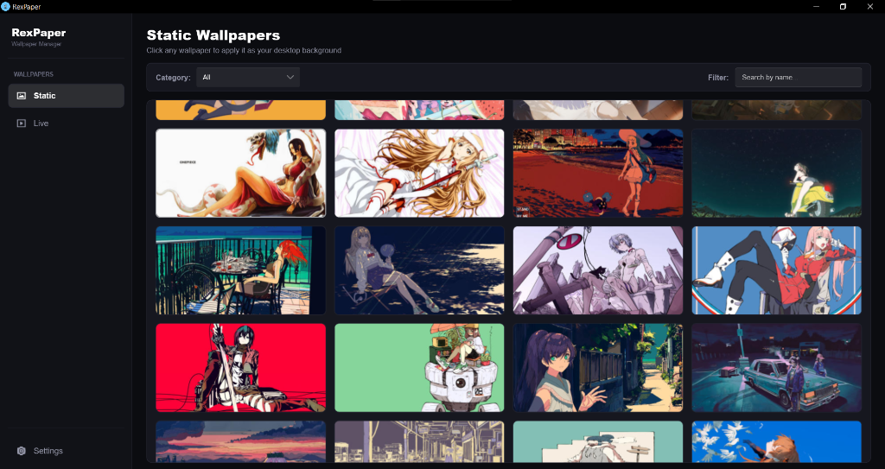
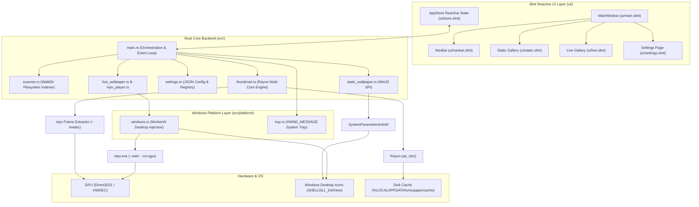

<p align="center">
  
</p>

<h1 align="center">RexPaper</h1>

<p align="center">
  <strong>A high-performance, native wallpaper manager for Windows with hardware-accelerated live video wallpapers.</strong>
</p>

<p align="center">
  
  
  
  
  
  
  
</p>

<p align="center">
  <a href="#overview">Overview</a> &bull;
  <a href="#features">Features</a> &bull;
  <a href="#supported-formats">Supported Formats</a> &bull;
  <a href="#tech-stack">Tech Stack</a> &bull;
  <a href="#architecture--engineering">Architecture & Engineering</a> &bull;
  <a href="#getting-started">Getting Started</a> &bull;
  <a href="#project-structure">Project Structure</a> &bull;
  <a href="#roadmap">Roadmap</a> &bull;
  <a href="#license">License</a>
</p>

<p align="center">
  
</p>

---

## Overview

**RexPaper** is a fast, lightweight, and modern desktop wallpaper manager engineered specifically for Windows 10 and 11. Built entirely with **Rust (Edition 2024)** and **Slint UI**, RexPaper pairs a sleek, reactive Fluent-styled interface with native Win32 desktop window manipulation and GPU-accelerated video playback powered by `mpv`.

Whether managing thousands of ultra-high-resolution 4K/8K static wallpapers or rendering seamless 60+ FPS live video wallpapers behind your desktop icons, RexPaper is designed from the ground up for minimal resource usage, instant startup, sub-millisecond gallery navigation, and zero UI stutter.

---

## Features

### High-Performance Static Wallpaper Gallery
- **Recursive Directory Scanning**: Scans custom wallpaper directories recursively and indexes entire collections in milliseconds.
- **Dynamic Category Organization**: Automatically groups wallpapers into clean categories based on subfolder structure (e.g., `Wallpapers/Anime/pic.jpg` &rarr; `Anime`).
- **Real-Time Instant Search**: Live text-filtering across titles and categories as you type.
- **Full-Bleed Modern Gallery Cards**: Edge-to-edge 16:9 widescreen card layout with subtle hover sheen effects, uniform 4-column responsive grid, and distraction-free presentation.
- **Native Win32 Wallpaper Application**: Applies static wallpapers directly via `SystemParametersInfoW(SPI_SETDESKWALLPAPER)` with instant desktop refresh.

### Hardware-Accelerated Live Video Wallpapers
- **GPU-Accelerated Video Engine**: Direct3D11 / GPU-powered rendering (`--vo=gpu`, `--hwdec=auto-safe`) delivering butter-smooth 60+ FPS playback with near-zero CPU consumption.
- **WorkerW Desktop Canvas Injection**: Injects video playback seamlessly behind Windows desktop icons (`SHELLDLL_DefView`) using `Progman` shell message `0x052C` and `WorkerW` reparenting.
- **In-App Interactive Preview**: Test and preview live video wallpapers within the application window before applying them to the Windows desktop.
- **Seamless Two-Way Transitions**:
  - **Live &rarr; Static**: Terminates the background `mpv` process, hides `WorkerW` (`SW_HIDE`), and sets the static image.
  - **Static &rarr; Live**: Reveals `WorkerW` (`SW_SHOW`), cleans up orphan processes, and launches hardware-accelerated playback attached to `--wid=<hwnd>`.
- **Live Wallpaper Controls**: Start, pause, resume, and stop desktop live wallpapers at any time with a single click.

### Multi-Core Background Precomputation & Disk Caching
- **Parallel Multi-Core Resizing**: Uses Rayon (`rayon::par_iter()`) across all available CPU threads to resize and precompute thumbnails in parallel on background threads without blocking the Slint UI.
- **GPU-Accelerated Frame Extraction**: Captures crisp high-definition video frames at 0.5s via `mpv` (`--vo=image`, `--hwdec=auto-safe`) for instantaneous video browsing.
- **Persistent Disk Caching**: Caches 384&times;216 px thumbnails in `%LOCALAPPDATA%/rexpaper/cache` using fast 64-bit cryptographic hashing (`v{:016x}.jpg`) for sub-millisecond lookup on subsequent launches.
- **98% Memory Reduction**: High-efficiency disk cache keeps RAM usage under **30 MB** even when browsing libraries containing thousands of large 4K/8K images and videos.
- **Crash-Proof Fault Tolerance**: All image decoding and thumbnail generation tasks are wrapped in `std::panic::catch_unwind` with clean dark placeholder fallbacks (`#181920`) if corrupt files are encountered.

### Deep Windows System Integration
- **Pure Windows Desktop Subsystem**: Compiled with `#![windows_subsystem = "windows"]` to completely eliminate terminal/console window flashes on launch.
- **Message-Only Background System Tray (`HWND_MESSAGE`)**: Custom Win32 message window (`WS_EX_TOOLWINDOW | WS_EX_NOACTIVATE`) that resides silently in the Windows Taskbar Notification Area without ghost taskbar entries or Alt-Tab clutter.
- **System Tray Context Menu**: Quick access to Open RexPaper, Static Wallpapers, Live Wallpapers, Settings, and Quit.
- **High-Resolution Vector & Small Icons**: Embedded PE Resource ID 1 loaded via `LoadImageW` at exact system small-icon metrics (`SM_CXSMICON`, `SM_CYSMICON`) for crisp icon rendering across all scaling factors.
- **Per-Monitor V2 HiDPI Awareness**: Enforces `DPI_AWARENESS_CONTEXT_PER_MONITOR_AWARE_V2` on startup for razor-sharp vector graphics, text, and layouts across 100%, 125%, 150%, 175%, and 200% display scaling.
- **Silent Windows Autostart**: Native registry integration (`HKCU\Software\Microsoft\Windows\CurrentVersion\Run`) with `--autostart` / `--minimized` flags to boot silently into the system tray.

### Configurable Settings & Persistence
- **Persistent JSON Configuration**: Application settings saved to `%APPDATA%/rexpaper/settings.json` via Serde.
- **Custom Directory Pickers**: Native Windows folder pickers via `rfd` (Rust File Dialog) for selecting static and live wallpaper library locations.
- **Configurable Toggles**:
  - *Run on Windows Startup* (automatic registry registration)
  - *Pause on Fullscreen* (reduces GPU/CPU usage when playing games or running full-screen software)
  - *Mute Live Wallpapers* (silent background playback)

### Enterprise Packaging & Distribution
- **WiX Toolset MSI Installer**: Enterprise `.msi` Windows installer package featuring custom splash and banner graphics, GPL-3.0 RTF license agreement dialog, Start Menu & Desktop shortcuts, and Windows Add/Remove Programs (ARP) integration.
- **Portable x64 Zip Package**: Self-contained standalone distribution bundling `rexpaper.exe`, `libmpv-2.dll`, `mpv.dll`, `mpv.exe`, `mpv.com`, assets, license, and docs.
- **Automated Build Staging (`build.rs`)**: Automatically discovers MSVC import libraries (`mpv.lib`), compiles Windows PE binary metadata/icons (`winres`), and stages dynamic runtime libraries (`libmpv-2.dll`, `mpv.dll`, `mpv-2.dll`) to build output targets.

---

## Supported Formats

| Media Type | Supported Formats / Extensions |
|---|---|
| **Static Images** | `.png`, `.jpg`, `.jpeg`, `.webp`, `.bmp`, `.gif`, `.avif`, `.tiff`, `.tif` |
| **Live Videos** | `.mp4`, `.webm`, `.mkv`, `.mov`, `.avi`, `.flv`, `.m4v`, `.gif`, `.mpg`, `.mpeg`, `.wmv` |

---

## Tech Stack

| Component | Technology | Description |
|---|---|---|
| **Language** |  Rust (Edition 2024) | High-performance, memory-safe systems programming language |
| **UI Framework** |  Slint GUI (1.17) | Modern declarative, reactive native GUI framework with Fluent styling |
| **Concurrency** |  Rayon (1.10) | Multi-core parallel iterators for background thumbnail precomputation |
| **Video Engine** |  libmpv & mpv (D3D11) | Direct3D11 / GPU hardware-accelerated video playback and frame extraction |
| **Win32 OS APIs** |  windows-rs (0.61) | Native Win32 API, `WorkerW` injection, `Shell_NotifyIconW`, DWM, HiDPI |
| **Image Processing** |  image-rs (0.25) | Fast image decoding, aspect-ratio scaling, and thumbnail generation |
| **Dialogs** |  rfd (0.15) | Native Windows folder and file picker dialogs |
| **Serialization** |  Serde & serde_json | Persistent JSON configuration in `%APPDATA%/rexpaper/settings.json` |
| **PE Resources** |  winres (0.1) | Windows executable metadata, versioning, and multi-res icon compiler |
| **Packaging** |  WiX Toolset | Windows Installer XML packaging for native `.msi` distribution |

---

## Architecture & Engineering



### 1. Multi-Core Background Precomputation & Disk Cache (`src/thumbnail.rs`)
- **Parallel Iteration**: `precompute_static_thumbnails` and `precompute_video_thumbnails` dispatch tasks across all available CPU threads using `rayon::par_iter()`.
- **Persistent Disk Caching**: Resized 384&times;216 px thumbnails are stored in `%LOCALAPPDATA%/rexpaper/cache/` using fast 64-bit cryptographic hash paths (`v{:016x}.jpg`), enabling sub-millisecond cache lookups.
- **GPU Hardware Decoding**: `mpv` video frame extraction specifies `--hwdec=auto-safe` for hardware-assisted decoding on Nvidia, AMD, and Intel GPUs.
- **Safe Fallback**: All decoding operations are isolated inside `std::panic::catch_unwind`, guaranteeing corrupt files never crash the application.

### 2. Desktop Wallpaper Injection Engine (`src/platform/windows.rs`)
- **WorkerW Layer Injection**: Dispatches shell message `0x052C` to `Progman` to spawn a dedicated `WorkerW` canvas layer behind desktop icons (`SHELLDLL_DefView`).
- **Silent Process Management**: Launches `mpv.exe` with `CREATE_NO_WINDOW (0x08000000)`, attached directly to the desktop window handle (`--wid=<hwnd>`) with `--vo=gpu`, `--gpu-api=auto`, and `--hwdec=auto-safe`.
- **Two-Way Seamless Transition**:
  - **Live to Static**: Terminates `mpv.exe`, hides `WorkerW` (`SW_HIDE`), and applies the static image via `SystemParametersInfoW(SPI_SETDESKWALLPAPER)`.
  - **Static to Live**: Un-hides `WorkerW` (`SW_SHOW`), terminates any previous process, and attaches `mpv.exe`.

### 3. Message-Only System Tray (`src/platform/tray.rs`)
- **`HWND_MESSAGE` Architecture**: Creates a message-only Win32 window with `WS_EX_TOOLWINDOW` and `WS_EX_NOACTIVATE`, ensuring no blank or duplicate windows appear on the Windows taskbar or in Alt-Tab.
- **High-Resolution Icon**: Queries the embedded application icon (Resource ID 1) using `LoadImageW` with exact small-icon metrics (`SM_CXSMICON`, `SM_CYSMICON`) for crisp rendering at all display scale factors.

### 4. Slint UI Architecture (`ui/`)
- **`ui/main.slint`**: Window root containing the navigation sidebar and smooth page cross-fading.
- **`ui/static.slint` & `ui/live.slint`**: Full-bleed responsive 4-column card grid with equal-weight layout distribution, category selectors, and instant search filtering.
- **`ui/store.slint`**: Centralized reactive state store managing wallpaper models, active themes, directory paths, and search queries.

---

## Getting Started

### Prerequisites

- [Rust & Cargo](https://www.rust-lang.org/tools/install) (Edition 2024 / 1.85+)
- Windows 10 SDK or later
- [WiX Toolset 3.11+](https://wixtoolset.org/) *(Optional, required only for building `.msi` installers)*

### Build and Run

```powershell
# Clone the repository
git clone https://github.com/theabsoluteray/rexpaper.git
cd rexpaper

# Run in development mode
cargo run

# Build in release mode (auto-stages mpv binaries and DLLs)
cargo build --release

# Run optimized release build
cargo run --release
```

### Building the WiX MSI Installer

```powershell
# 1. Build release binaries
cargo build --release

# 2. Compile WiX manifest
candle.exe -out "wix\obj\main.wixobj" "wix\main.wxs"

# 3. Link MSI installer
light.exe -out "RexPaper-1.0.0-x64.msi" "wix\obj\main.wixobj" -ext WixUIExtension -cultures:en-us
```

### Creating the Standalone Portable Package

```powershell
$portableDir = "RexPaper-Portable-x64"
New-Item -ItemType Directory -Path $portableDir -Force | Out-Null
Copy-Item target/release/rexpaper.exe $portableDir/
Copy-Item target/release/libmpv-2.dll $portableDir/
Copy-Item target/release/mpv.dll $portableDir/
Copy-Item target/release/mpv.exe $portableDir/
Copy-Item target/release/mpv.com $portableDir/ -ErrorAction SilentlyContinue
Copy-Item -Recurse assets $portableDir/
Copy-Item README.md $portableDir/
Copy-Item LICENSE $portableDir/
Compress-Archive -Path "$portableDir\*" -DestinationPath "RexPaper-1.0.0-Portable-x64.zip" -Force
```

---

## Project Structure

```
rexpaper/
├── assets/                  # Vector SVG icons, preview screenshots, and multi-resolution icon.ico
│   ├── icon.ico             # Embedded application icon (16x16 to 256x256)
│   ├── logo.svg             # RexPaper dinosaur brand logo
│   ├── preview.png          # Application UI preview screenshot
│   ├── live.svg             # Navigation icon for Live Wallpapers
│   ├── static.svg           # Navigation icon for Static Wallpapers
│   └── settings.svg         # Navigation icon for Settings
├── mpv/                     # Standalone mpv binary and libmpv-2.dll
├── mpv-lib/                 # MSVC mpv.lib import library and def file
├── src/
│   ├── main.rs              # Application entry point, GUI subsystem, & state sync
│   ├── lib.rs               # Library root and Slint type re-exports
│   ├── models.rs            # Wallpaper models, categories, and row grouping
│   ├── scanner.rs           # Recursive filesystem wallpaper directory scanner
│   ├── thumbnail.rs         # Multi-core thumbnail precomputing & disk cache engine
│   ├── settings.rs          # Persistent JSON settings manager & autostart registry
│   ├── static_wallpaper.rs  # Static wallpaper scanning and Win32 application
│   ├── live_wallpaper.rs    # Live wallpaper controller and playback coordinator
│   ├── mpv_player.rs        # libmpv backend bindings
│   └── platform/
│       ├── mod.rs           # Platform abstraction interface
│       ├── windows.rs       # Win32 WorkerW injection & mpv background process
│       └── tray.rs          # Native message-only system tray implementation
├── ui/                      # Slint declarative UI files
│   ├── main.slint           # Main application window with page transitions
│   ├── store.slint          # Theme tokens & global AppStore state
│   ├── navbar.slint         # Navigation sidebar with SVG icons
│   ├── static.slint         # Static wallpapers gallery page (full-bleed cards)
│   ├── live.slint           # Live wallpapers gallery page (full-bleed cards)
│   ├── settings.slint       # Application settings page
│   ├── area.slint           # Hit-test area helper component
│   └── components/
│       └── VideoPlayer.slint# Video player UI component
├── wix/                     # WiX Toolset installer packaging
│   ├── main.wxs             # WiX installer manifest & shortcut definitions
│   ├── license.rtf          # GPL-3.0 rich text license agreement
│   ├── dialog.bmp           # Installer splash cover background
│   └── banner.bmp           # Installer top header banner
├── .github/workflows/
│   └── release.yml          # Tag-triggered Windows CI/CD release & WiX MSI workflow
├── build.rs                 # Resource compiler (winres) & DLL auto-staging script
├── Cargo.toml               # Cargo dependencies & manifest
└── LICENSE                  # GNU General Public License v3.0
```

---

## Roadmap

- [x] **Automatic DLL Aliasing & Staging** &mdash; Resolved `0xc0000135 (STATUS_DLL_NOT_FOUND)` via `build.rs` auto-discovery and staging.
- [x] **Responsive Card Layout** &mdash; Uniform 4-column responsive grid with equal-weight column distribution.
- [x] **Full-Bleed Card Design** &mdash; Edge-to-edge preview cards with clean 16:9 aspect ratio and hover sheen.
- [x] **Parallel Multi-Core Precomputation** &mdash; Multi-threaded background thumbnail generation across CPU cores (`rayon`).
- [x] **GPU-Accelerated Video Extraction** &mdash; Real video frame extraction at 0.5s timestamp via `mpv` (`--hwdec=auto-safe`).
- [x] **Ultra-Low Memory Disk Cache** &mdash; 98% memory reduction (< 30 MB RAM) across thousands of high-resolution items.
- [x] **Console Window Flash Suppression** &mdash; Clean GUI launches with `#![windows_subsystem = "windows"]`.
- [x] **Message-Only System Tray** &mdash; Background `HWND_MESSAGE` tray sink with context menus and zero ghost taskbar entries.
- [x] **Per-Monitor V2 HiDPI Awareness** &mdash; Crisp rendering across all display scaling percentages.
- [x] **WiX MSI & Portable Packaging** &mdash; Standalone `.msi` installer and portable `.zip` bundles.
- [ ] **Multi-Monitor Wallpaper Assignment** &mdash; Assign independent wallpapers per display monitor.
- [ ] **Granular Live Audio Volume Slider** &mdash; In-app slider to adjust live wallpaper volume levels.

---

## License

This project is licensed under the **GNU General Public License v3.0** &mdash; see the [LICENSE](LICENSE) file for details.

<p align="center">
  Made by <a href="https://github.com/theabsoluteray">theabsoluteray</a>
</p>
